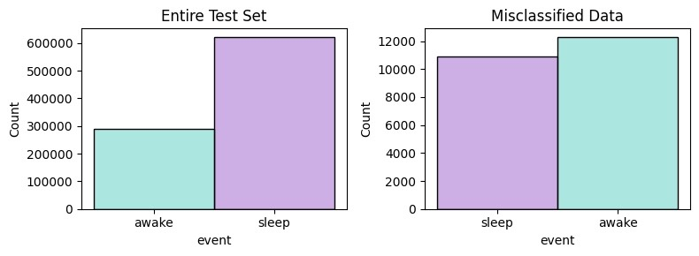

# Smart Start
In this repository we develop a neural network to detect the wakeup event from accelerometer data. Summarizing slides can be found [here](LINK TO SLIDES).

### Problem
Getting out of bed in the morning can be a struggle—we're faced with the jarring cold light, a chilly bathroom, and the anticipation of waiting for the coffee machine to preheat. How can we improve this morning routine? The idea is to have smart systems recognizing our (soon) wakeup, gradually increasing light, warming up the bathroom, and having the coffee machine ready for a quick brew.

### Our Vision
Our aim is to leverage sensor data and machine learning to develop a model that recognizes when a person is waking up only by smart watch accelerometer data. This will trigger the appropriate setup of you home through a Smart Start/Smart Home app enabling a perfect start of the day!

### Data
In our pursuit of relevant data, we found [this Kaggle Challenge]((https://www.kaggle.com/competitions/child-mind-institute-detect-sleep-states/data)), which provided wrist-worn accelerometer data comparable to that from ordinary smartwatches—widely worn during sleep. Prioritizing personal data protection, we opted for a minimal dataset. Given the intended app deployment on smartphones which limited internal storage and processing space, we chose to work with only accelerometer data.

### Data Analyis
During [exploratory data analysis (EDA)](https://github.com/HPweck/sleepy_kid_Zzzz/blob/hannes_2/child-mind-institute-detect-sleep-states/EDA_Clean/to_be_cleaned/EDA_clean.ipynb), we identified missing information on various events in the original event dataset and subsequently removed these instances. We noted that, the main difference between sleep and wakefulness is represented by more frequent changes in the  'ENMO' and 'z-angle'. </p> During [feature engineering](https://github.com/HPweck/sleepy_kid_Zzzz/tree/David_make_data) focused on accentuating these differences. </p> 


### Model Development:
Beginning with basic 'ENMO' and 'z-angle' measurements, a first [decision tree model](https://github.com/HPweck/sleepy_kid_Zzzz/blob/models/model_DecisionTree1.ipynb) demonstrated an initial accuracy of 88%. Incorporating newly engineered features significantly resulted in a [model](https://github.com/HPweck/sleepy_kid_Zzzz/blob/models/model_DecisionTree1_allData.ipynb) with an improved performance to 97.5%. 

In [error analysis](https://github.com/HPweck/sleepy_kid_Zzzz/blob/models/model_DecisionTree_allData_ErrorAnalysis.ipynb), we noticed proficient pattern recognition, with a slight bias towards sleep classification. 
Notably, misclassifications occurred predominantly during moments waking up. 

Because this is the most important event in terms of our business question, we further explored neural networks for classification.

### Final Model and Error Analysis
Our final 2 layer classical artificial neural network [ANN model]() predicts sleep and awake states with an accuracy of 97.68%.
It is better in prediction 'sleep' than 'awake' and is weak only at predicting the current state precisely during sleep onset and wakeup events:


### Next Steps
We could further imrpove the model by additional feature engineering such as calculated standard deviation, mean and maximum values over a longer period of time. For the usecase we could also include more sensor data like heart beat rate, body temperature and / or skin conductance, that can also easily be measured with common smart watches.


To setup the virtual environment used in this repository run the following code:

```BASH
pyenv local 3.11.3
python -m venv .venv
source .venv/bin/activate
pip install -U pip
pip install -r requirements.txt
```

