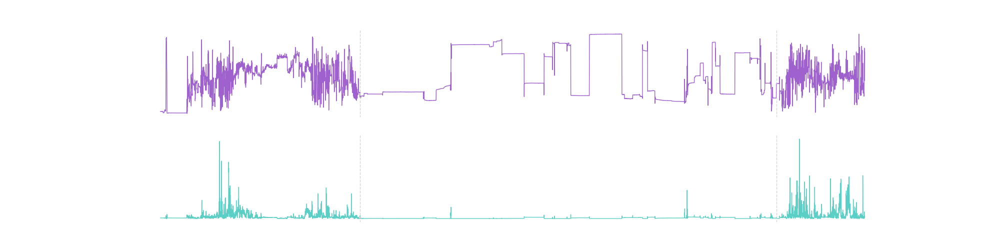
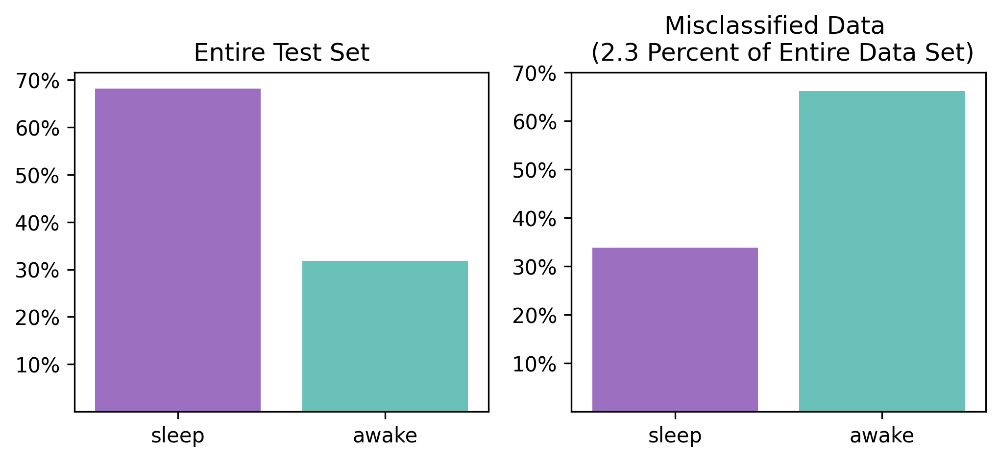

# Smart Start
In this repository we develop a neural network to detect the wakeup event from accelerometer data. Summarizing slides can be found [here](https://github.com/SonkyD/Smart-Start/blob/main/smart_start.pdf).

### The Problem
Getting out of bed in the morning can be a struggle—we're faced with the jarring cold light, a chilly bathroom, and the anticipation of waiting for the coffee machine to preheat. How can we improve this morning routine? The idea is to have smart systems recognizing our (soon) wakeup, gradually increasing light, warming up the bathroom, and having the coffee machine ready for a quick brew.

### Our Vision
Our aim is to leverage sensor data and machine learning to develop a model that recognizes when a person is waking up only by smart watch accelerometer data. This will trigger the appropriate setup of you home through a Smart Start/Smart Home app enabling a perfect start of the day!

### The Data
In our pursuit of relevant data, we found [this Kaggle Challenge](https://www.kaggle.com/c/child-mind-institute-detect-sleep-states), which provided wrist-worn accelerometer data comparable to that from ordinary smartwatches—widely worn during sleep. Prioritizing personal data protection, we opted for a minimal dataset. Given the intended app deployment on smartphones which limited internal storage and processing space, we chose to work with only accelerometer data.

### Data Analyis
During [exploratory data analysis (EDA)](https://github.com/SonkyD/Smart-Start/blob/main/EDA/EDA_clean.ipynb), we identified missing information on various events in the original event dataset and subsequently removed these instances. We noted that, the main difference between sleep and wakefulness is represented by more frequent changes in the  'ENMO' and 'z-angle'. </p> During feature engineering ([executed during preprocessing in this script](https://github.com/SonkyD/Smart-Start/blob/main/data_processing/data_preprocessing_script.py)) we focused on accentuating these differences. </p> 

### Feature Engineering
Explanation of (newly engineered) features in the data:

| Features                       | Explanation |
|--------------------------------|-------------|
| anglez                         | As calculated and described by the [GGIR package](https://cran.r-project.org/web/packages/GGIR/vignettes/GGIR.html#4_Inspecting_the_results), z-angle is a metric derived from individual accelerometer components that is commonly used in sleep detection, and refers to the angle of the arm relative to the vertical axis of the body. The data was then binned from 5s per data point to 1 min per data point for feature engineering.            |
| enmo                           |As calculated and described by the [GGIR package](https://cran.r-project.org/web/packages/GGIR/vignettes/GGIR.html#4_Inspecting_the_results), ENMO is the Euclidean Norm Minus One of all accelerometer signals, with negative values rounded to zero. While no standard measure of acceleration exists in this space, this is one of the several commonly computed features.The data was then binned from 5s per data point to 1 min per data point for feature engineering.                 |
| step                           |   An integer timestep for each observation within a series.          |
| timestamp                      |A corresponding datetime with ISO 8601 format %Y-%m-%dT%H:%M:%S%z.             |
| series_id                      |Unique identifier for each accelerometer series.             |
| anglez_std                     |Standard deviation of 1 min of Angle-z             |
| enmo_std                       |Standard deviation of 1 min of ENMO             |
| slope_enmo                     | Calculation of the slope of ENMO for the duration of 1 minute             |
| slope_anglez                   |Calculation of the slope of Angle-z for the duration of 1 minute             |
| anglez_outside_45_counter      | Counted the number of times Angle-Z was over +45° or under -45° in 1 minute             |
| enmo_over_008_counter          | Counted the number of times ENMO was 0.008 in 1 minute.             |
| anglez_difference_5_per_min    |Counter how often the Angle-z differed over 5° in 5 minutes             |
| anglez_5min_mean               |Rolling calculation for the mean value of Angle-z in a 5 minute window.             |
| anglez_5min_std                | Rolling calculation for the standard deviation of Angle-z in a 5 minute window.            |
| anglez_5min_mean_shifted       |Rolling calculation for the mean of Angle-z in a 5 minute window and forward shifted for a time window of 5 minutes             |
| anglez_5min_std_shifted        |Rolling calculation for the standard deviation of Angle-z in a 5 minute window and forward shifted for a time window of 5 minutes              |
| enmo_5min_mean                 |Rolling calculation for the mean of ENMO in a 5 minute window              |
| enmo_5min_std                  |Rolling calculation for the standard deviation of ENMO in a 5 minute window             |
| enmo_5min_mean_shifted         |Rolling calculation for the mean of ENMO in a 5 minute window and forward shifted for a time window of 5 minutes      |
| enmo_5min_std_shifted          |Rolling calculation for the standard deviation of ENMO in a 5 minute window and forward shifted for a time window of 5 minutes             |
| anglez_10min_mean              |Rolling calculation for the mean of Angle-z in a 10 minute window              |
| anglez_10min_std               |Rolling calculation for the standard deviation of Angle-z in a 10 minute window             |
| anglez_10min_mean_shifted      |Rolling calculation for the mean of Angle-z in a 10 minute window and forward shifted for a time window of 10 minutes             |
| anglez_10min_std_shifted       |Rolling calculation for the standard deviation of Angle-z in a 10 minute window and forward shifted for a time window of 10 minutes             |
| enmo_10min_mean                |Rolling calculation for the mean of ENMO in a 10 minute window             |
| enmo_10min_std                 |Rolling calculation for the standard deviation of ENMO in a 10 minute window             |
| enmo_10min_mean_shifted        |Rolling calculation for the mean of ENMO in a 10 minute window and forward shifted for a time window of 10 minutes             |
| enmo_10min_std_shifted         |Rolling calculation for the standard deviation of ENMO in a 10 minute window and forward shifted for a time window of 10 minutes             |
| anglez_enmo_ratio              | Calculate the ratio of Angle-z and ENMO for a 1 minute duration             |
| night                          | An enumeration of potential onset / wakeup event pairs. At most one pair of events can occur for each night.             |
| event            |The type of event, whether onset, wakeup, sleep or awake             |
| minutes_since_onset            | Calculates the minutes since the onset event for the current data point             |
| year                           | Extracted year of the timestamp for the current data point             |
| month                          |Extracted month of the timestamp for the current data point             |
| day                            | Extracted day of the timestamp for the current data point            |
| hour                           | Extracted hour of the timestamp for the current data point            |
| minute                         |Extracted minute of the timestamp for the current data point             |


### Model Development
Beginning with basic 'ENMO' and 'z-angle' measurements, a first [decision tree model](https://github.com/SonkyD/Smart-Start/blob/main/Models/simple_Dec_Tree.ipynb) demonstrated an initial accuracy of 75.9%. Incorporating newly engineered features significantly resulted in a [model](https://github.com/SonkyD/Smart-Start/blob/main/Models/Dec_Tree_incl_engineered_features.ipynb) with an improved performance to 97.5%. We tied different other model types ([Random Forest](https://github.com/SonkyD/Smart-Start/blob/main/Models/RandomForest.ipynb), [XGBoost](https://github.com/SonkyD/Smart-Start/blob/main/Models/XGBoost.ipynb)) without further improving the accuracy.

### Final Model and Error Analysis
Our final 2 layer classical artificial neural network [ANN model](https://github.com/SonkyD/Smart-Start/blob/main/Models/Artificial_Neural_Network.ipynb) predicts sleep and awake states with an accuracy of 97.68%.
It is better in prediction 'sleep' than 'awake' and is weak only at predicting the current state precisely during sleep onset and wakeup events:

In [error analysis](https://github.com/SonkyD/Smart-Start/blob/main/error_analysis/Error_Analysis_ANN.ipynb), we noticed proficient pattern recognition, with a slight bias towards sleep classification. 
Notably, misclassifications occurred predominantly during moments waking up. 


### Conclusion
We could further imrpove the model by additional feature engineering such as calculated standard deviation, mean and maximum values over a longer period of time. For the usecase we could also include more sensor data like heart beat rate, body temperature and / or skin conductance, that can also easily be measured with common smart watches. In addition, we could refine the model by adding a personal 'wakeup' and /or sleep time window for the specific user. Besides that it would aso be possible to switch the focis a bit from prediciton of sleep vs. awake to prediciting the exact onset and wakeup event themselfs.

### Summary
Overall, we developed a machine learning model, more precisely an artificial neural network, that predicts sleep and awake state with an accuracy of 97.68 % only by using acceleration data. Our model outperfomrs a previously published Random Forest model which showed an accuracy of 74%. We achieved this by analyzing only acceleration data. Relying only on few, basic data is beneficial for the end user due to data privacy reasons. In summary, we developed a model that can be integrated into a smart home application triggering e.g preheating your coffee machine and warming up your bath and living room nabling you a great start into the day! 

| Contributors |
| --- |
| David Marks |
| Tabea Nöthe-Menchen |
| Hannes Peter Wecker |

### :two_hearts: Acknowledgement :two_hearts:
We are thankful to the Child Mind Institute for providing the data. We acknowledge Tim Schlange for his contributions during the start phase of this project. In addition, we thank all the neue fische coaches for introducing us to the world of data science and answering our questions. The 'Smart Start logo' was generated using OpenAI's DALL-E.

### License
Data was provided under the [CC BY-NC-SA license](https://creativecommons.org/licenses/by-nc-sa/4.0/).

### Setting up the Environment
To setup the virtual environment used in this repository run the following code:
```BASH
pyenv local 3.11.3
python -m venv .venv
source .venv/bin/activate
pip install -U pip
pip install -r requirements.txt
```

